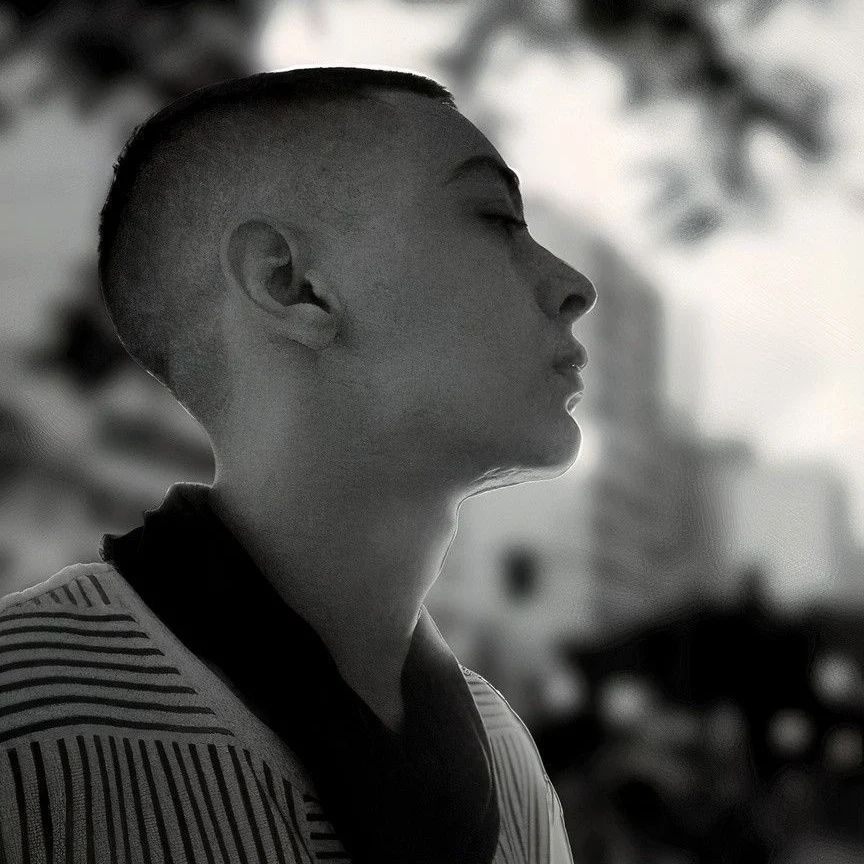

<body style="color: grey; background: black;">

### 
Me chamo Dioney e estou iniciando meu aprendizado na área de frontend 👨‍💻  trabalhando no momento no meu desenvolvimento pessoal 🚀

- 🔭 Meu portfólio [aqui](https://simpledioney.github.io)

- 🌱 Estou estudando e testando meus conhecimentos!

- ❓ Amo coisas relacionadas ao espaço, ficção e tecnologias. Meu filme favorito é Interestelar!

- ⚡ Código organizado, porfavor!

 

## Skilss
<table><tr><td valign="top" width="33%">

### Frontend

</td><td valign="top" width="33%">

### --

</td><td valign="top" width="33%">

### --

</td></tr></table>

 

## Redes

 

## Github Status

 

## Recentes
<!-- BLOG-POST-LIST:START -->
<!-- BLOG-POST-LIST:END -->

 

 

</body>
